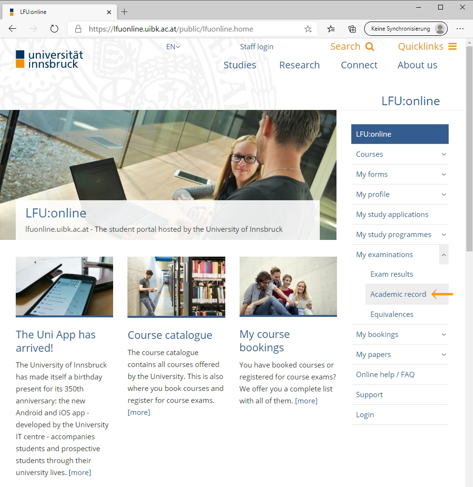
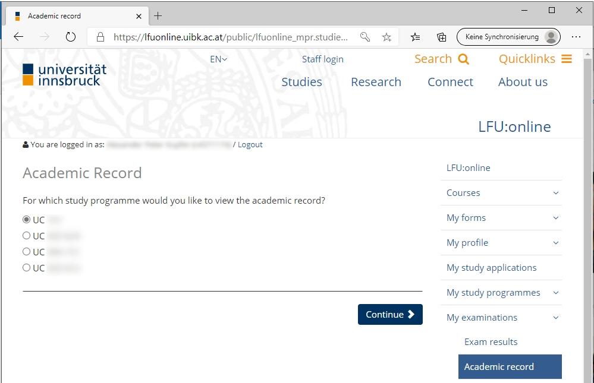
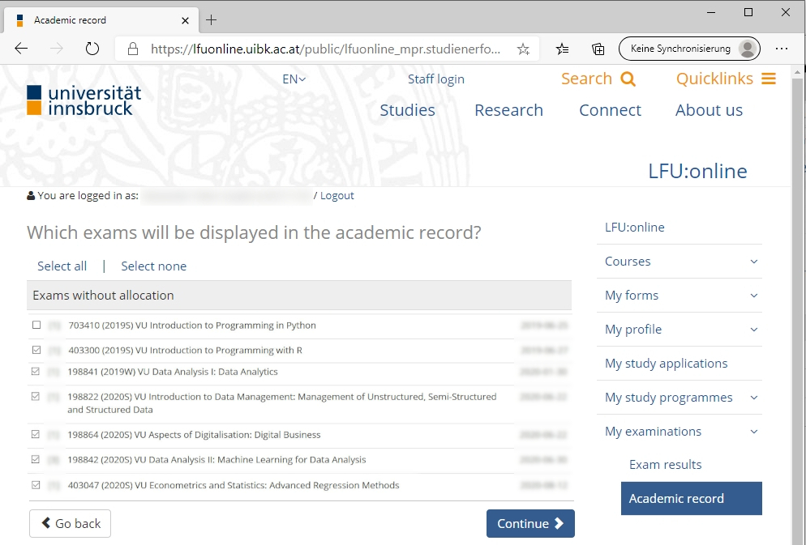
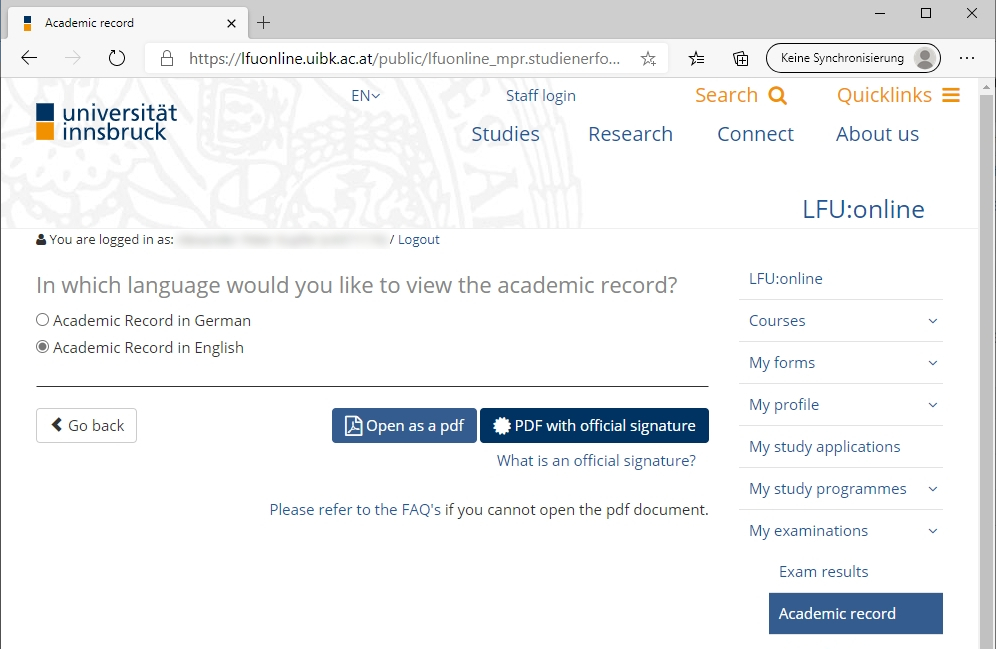
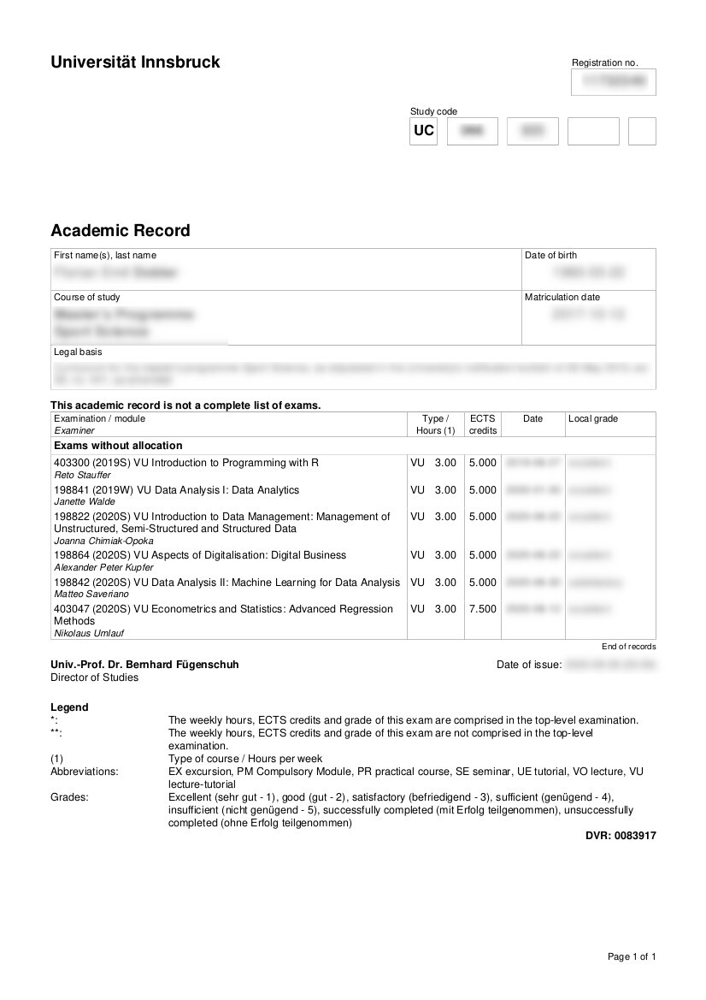

Confirmation 
=============

### Confirmation document (modules)

After completion of all modules within our minor, you can get a **document confirming the completion of our minor**. In this document, all modules (not courses) are listed, it is signed by our study dean and it is available in English and German.  See the photos of [alumni with their documents](javascript:parent.gotonode(102287125809786)).

### A subset of academic records (courses and grades)

If you want to have a document where all our courses are listed, you can generate a **subset of [your academic record](https://lfuonline.uibk.ac.at/public/lfuonline_mpr.studienerfolgsnachweis)** using LFU:online. Here, you have the steps on how to do it.

