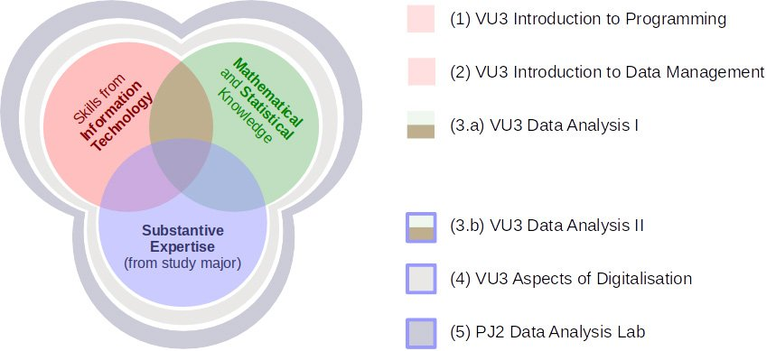

---
# https://vitepress.dev/reference/default-theme-home-page
layout: doc

prev: false

# hero:
#   name: "Minor Digital Science"
#   text: "Information about the Minor Digital Science."
#   tagline: My great project tagline
#   actions:
#     - theme: brand
#       text: Markdown Examples
#       link: /markdown-examples
#     - theme: alt
#       text: API Examples
#       link: /api-examples

# features:
#   - title: Feature A
#     details: Lorem ipsum dolor sit amet, consectetur adipiscing elit
#   - title: Feature B
#     details: Lorem ipsum dolor sit amet, consectetur adipiscing elit
#   - title: Feature C
#     details: Lorem ipsum dolor sit amet, consectetur adipiscing elit
---

# Teaching

The teaching portfolio of DiSC is available to all students of the University of Innsbruck. We offer the Minor Digital Science and are involved in other teaching-related initiatives.

The Minor Digital Science is a bundle of courses designed to provide a solid foundation of digitalization. 
 
 

Successively, our teaching portfolio will be enlarged and adjusted to optimally extend students’ skill sets.

 

## Similar programs
Besides our teaching offer, there are other programs related to digitalization, for example:

* The [Supplementary Program Computer Science](https://www.uibk.ac.at/studium/angebot/es-informatik.html.en) provides a rigorous education in the fundamentals of computer science to non-majors (60 ECTS credits).
* The [Doctoral College Computational Interdisciplinary Modelling](https://www.uibk.ac.at/dk-cim/) provides research-guided training in computational modeling utilizing high-performance computing.
* The [Doctoral College #OrganizingtheDigital](https://www.uibk.ac.at/epos/doctoral-college/otd/index.html.en) is a PhD training program that takes a multi-method and inter-disciplinary approach to studying digital relations, digital publics, and digital societies.
* The [Data Science continuous-education course (ULG)](https://www.uibk.ac.at/mathematik/datascience/) is aimed at professionals who are interested in analytic questions and want to become data handling experts (90 ECTS credits).
* Within the [AURORA Network](https://www.uibk.ac.at/international/aurora/) it is possible to take [internal courses](https://www.uibk.ac.at/en/international/aurora/aurora-course-offerings/) from our university and [external courses from partner universities](https://aurora-universities.eu/course-catalogue/). Many courses are interdisciplinary and related to digitalization, selected DiSC courses are also offered within AURORA.  
