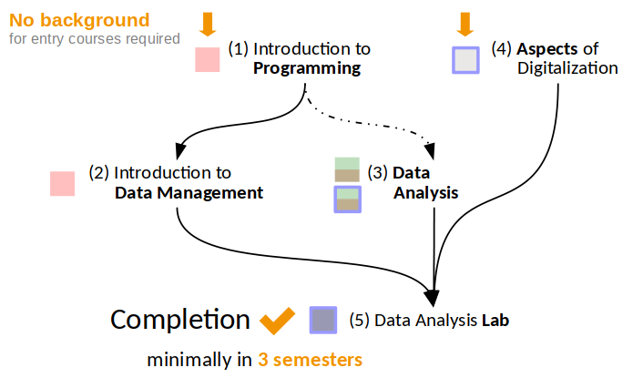

# Suggested order 

For an optimal learning outcome, it is recommended to complete the Minor Digital Science over **3 to 4 semesters** following the suggested paths.

While there are no formal requirements for taking particular modules, following the suggested order ensures an efficient way of learning and minimises the time required for self-study to catch up with prerequisite knowledge and skills. The dependencies are defined for particular courses as prerequisites.

It is very important, to complete the (5) *Data Analysis Lab* course at the end. In the **final course**, students individually conduct a data-based decision-making process on selected projects applying their knowledge and skills gained in all preceding modules.

In general, as from 21S, courses in modules 1-3a, 5 are offered every semester. For courses in modules 3b and 4 at least one instance is offered every semester.

