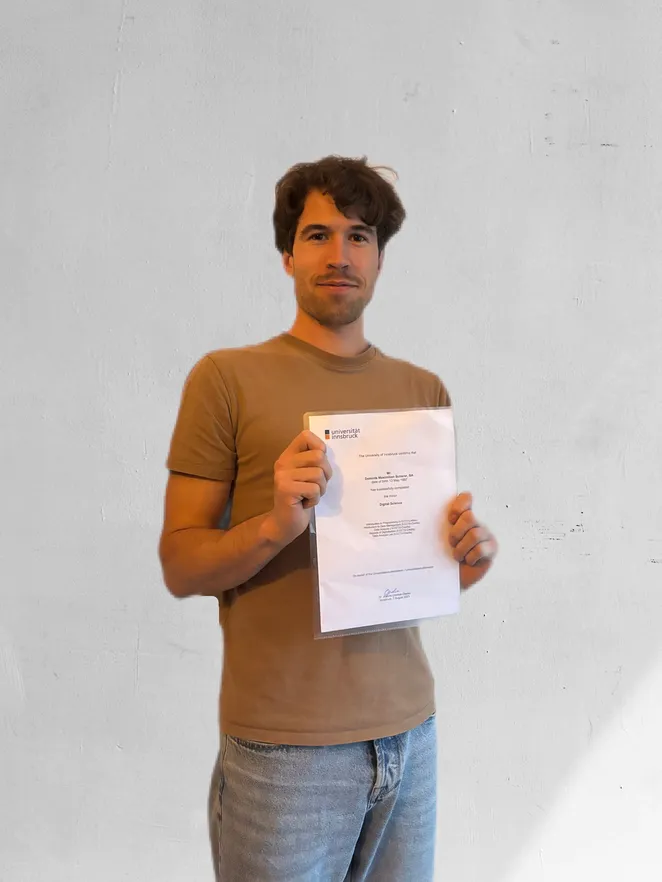
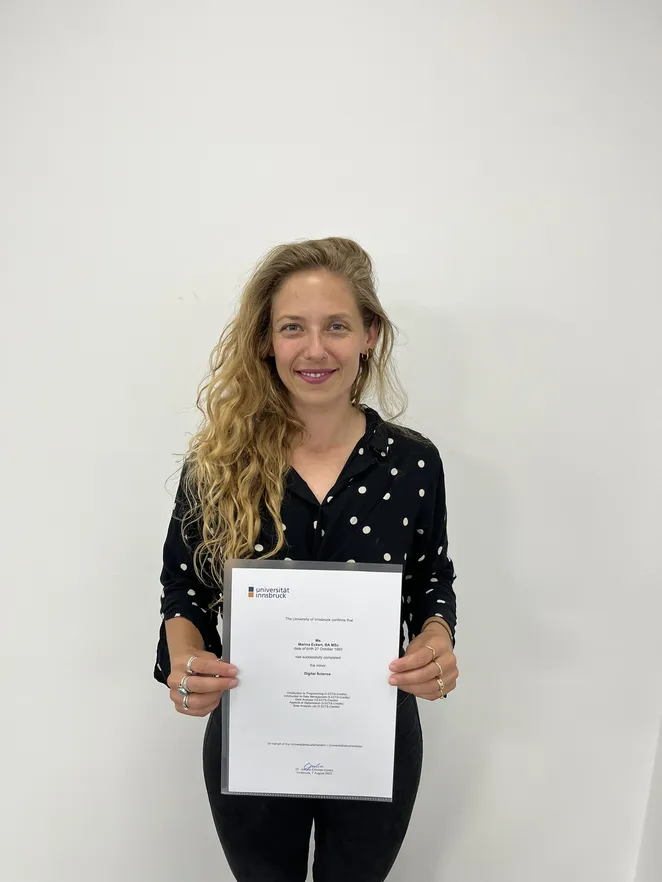

Testimonials
============

**What (former) students say about our minor:**

Dominik Scherer  
Applied Economics

*   Start of minor: Winter semester 2020/21
*   Completion of minor: Summer semester 2023
*   Topic of the final project: Rainy Sundays as political threat? How weather on election day affects voter turnout
*   Fun fact: Because of the Minor Digital Science (and some other non-mandatory courses I was interested in), I earned more ECTS credits in my master’s program than in my bachelor’s.

::: details How did you find out about the “Minor Digital Science”?

Achim Zeileis, a professor from the Department of Statistics, teaches many courses in my field of study and does not miss any opportunity to convince students to enroll in the Minor Digital Science. It worked in my case.

:::

::: details What area of your studies could you apply your newly acquired skills to?

Since many economics courses are in some way related to statistics and since many tasks in these courses begin with some kind of data set, the skills I acquired in the minor helped solve such tasks more efficiently. I could therefore apply them to vast parts of my studies.

:::

::: details Do you believe that your future career will benefit from the minor?

It already did. I started a trainee program at Deutsche Bahn. They were specifically looking for master’s graduates who can help drive digitalization. Hence, I doubt that I would have got the job without the minor. Even though I figured out that R is not frequently used apart from scientific purposes and I now need to switch to using Python, I am convinced that I will benefit from what I have learned. I sometimes even go back to the course materials looking for certain slides or code chunks.

:::

 

 

Marina Eckert  
Comparative Literature (UIBK), Sustainable Regional and Destination Development (UMIT Masters)

*   Start of minor: Winter semester 2020/21
*   Completion of minor: Summer semester 2023
*   Topic of the final project: Automatization of an Evaluation Process using the Example of the Monthly Tracking of Emobil GmbH & Co KG Charging Stations
*   Fun fact: I only enrolled in my second program of study because of the minor :D

::: details How did you find out about the “Minor Digital Science”?

I found out about the minor during the covid pandemic. I had time to read my university emails a little more carefully back then, and I saw the invite for the twitch info meeting, which caught my attention. I joined the meeting to learn more about the minor and found the idea super interesting and fascinating. I was also slightly bored during covid, and felt like this could be something to do during that time.

:::

::: details What area of your studies could you apply your newly acquired skills to?

I did some data analysis (clustering of customers) for my master’s thesis, which was about Glacier Tourism. I did that with SPSS, but when I learned how to program all that with Python I was a little bit annoyed that I had not done it like this earlier. I also saw how my skills could benefit me at my job, so I wanted to learn a lot more about it - even more so in the working context, to really apply what I learned and implement things with it.

::: details Do you believe that your future career will benefit from the minor?

YES, YES and YES! I do! I continued with the minor even after I finished my master’s degree because I think data in general is going to be a lot more important topic in the future then it is already now. I realized this already when I applied for jobs and I had "Basic knowledge in Python" written on my CV. That even got me a few invitations for interviews.

:::

 

 

::: details More Testimonials

Jonas Dreher  
Psychology
-------------------------

*   Start of minor: Summer semester 2019
*   Completion of minor: Summer semester 2021
*   Topic of the final project: Changes in Mobility during the Covid-19 Pandemic and its Effects on Spread on Coronavirus Cases in Austria.
*   Fun fact: I like pythons as long as they are on my computer.

How did you find out about the "Minor Digital Science"?

I attended a seminar in psychology, where someone gave a talk on "digitalization". The take home message was clear: Everybody should learn a programming language, at least the basics, to have some background knowledge about the systems that influence our lives and that we interact with daily. That prompted me to start the course in "Introduction to Python" which I liked so much that I decided to take the whole “Minor Digital Science”.

What area of your studies could you apply your newly acquired skills to?

Instead of carrying out the data analysis in my master’s thesis with SPSS as is common in psychology, I was able to apply the skills I learned during the minor by using Python. This allowed me to perform much more complex statistical analyses that are not available in SPSS. The charts I created were also of higher quality.

Do you believe that your future career will benefit from the minor?

I know it, because I got my current job due to the fact that I have these special Digital Science skills. I closely work together with programmers and the knowledge I acquired in the minor helps me carry out my duties and communicate with the team!

Benny Greif  
Psychology
------------------------

*   Start of minor: Summer semester 2019
*   Completion of minor: Summer semester 2021
*   Topic of the final project: The Role of Personality for Emotional Abilities in a Social Context
*   Fun fact: In the currciulum of my master’s program, it was not possible to incorporate a minor. That’s why I took the “Minor Digital Science” on top of my regular courses. The additional workload was manageable, though. :)

How did you find out about the "Minor Digital Science"?

A friend of mine told me about a course where students not studying Computer Science could learn how to program, "Introduction to Python". I learned a lot in the course and it fuelled my curiosity so I wanted to immerse myself even deeper into the subject. The contents of the minor also seemed to complement the contents of my major very well, so I took more modules step by step. At first, I did not expect to complete the whole minor, but in the end it happened almost automatically.

What area of your studies could you apply your newly acquired skills to?

Any form of handling data and carrying out statistical evaluations is now easier for me. I have become more flexible and am able to automate processes. Human-machine-interaction is also a very relevant and modern field of psychology where I have acquired a lot of additional knowledge. In "Aspects of Digitalization", I attended a course with a strong focus on philosophy. It made me aware of the interconnectedness of society, the human mind and digitalization as well as the challenges associated with it. The insigths from this course were also useful for other seminars.

Do you believe that your future career will benefit from the minor?

Yes, in two different ways. On the one hand, statistics, data and programming skills are in high demand in almost any industry. If you are head to head with another applicant for a job, these skills may be the reason why you are selected. On the other hand, the minor allowed me to learn how to approach completely new areas of research and how to deal with new topics and lines of thinking. This has instilled confidence in me for my job search.

Benjamin Reimeir  
Sport Science
--------------------------------

*   Start of minor: Winter semester 2019/2020
*   Completion of minor: Summer semester 2021
*   Topic of the final project: Quality Analysis of Motion Capture Data
*   Fun fact: -

How did you find out about the "Minor Digital Science"?

The way it all began may sound trivial: I simply needed a course for the “Interdisciplinary Skills” module. In the past few years, I often said to myself and to others: If I had the time, I would start another bachelor’s program in Computer Science, just out of interest. When I saw “Introduction to Programming with Python“ among the options for the “Interdisciplinary Skills” module, I knew this was my chance. I took it and never regretted my choice. I continued with other courses from the minor and ended up completing the whole package.

What area of your studies could you apply your newly acquired skills to?

My master’s thesis was about human balance and postural control. The methods I used to perform measurements rely heavily on data (capturing motion, measuring ground reaction forces). When analyzing the collected data, many of the skills I obtained in the "Minor Digital Science" were of great help to me, especially since my approach did not follow a standard method. My analysis was a little unconventional and therefore required writing lots of code.

Do you believe that your future career will benefit from the minor?

In the past couple of years, sensors and data have played an ever-increasing role in sport science. This is true for almost all areas, from physiology to biomechanics. In the future, researchers who do not have a firm grasp of data analysis will, in all likelihood, no longer contribute anything new to the discipline. I now work in a research group for prototype development and evaluation of exoskeletons, which is at the intersection of sport science and mechatronics. Analyzing measurement data is an essential part of the job.

Florian Dobler  
Sport Science
------------------------------

*   Start of minor: Summer semester 2019
*   Completion of minor: Summer semester 2020
*   Topic of the final project: Competition Analysis Biathlon World Cup 2010-2020
*   Fun fact: He was the first student to complete the Minor Digital Science. Learn more on Twitter and in the university's newsroom: [initial presentation](https://twitter.com/DiSC_uibk/status/1254749599497142277), [final presentation](https://twitter.com/DiSC_uibk/status/1296721886013992960), [Unileben article](https://www.uibk.ac.at/de/newsroom/2020/florian-dobler-ist-erster-digital-science-finisher/)

How did you find out about the "Minor Digital Science"?

Sport science students can choose a small number of courses freely within the interdisciplinary skills module. When browsing through the list of courses available at the university, I found a programming course offered by the Digital Science Center and decided to take it. Since this course was already part of the minor and the topics and the way of teaching appealed to me, I opted for the whole package.

What area of your studies could you apply your newly acquired skills to?

Digitalization is an important and current topic in sport science, just as in other disciplines. Unfortunately, the curriculum only reflects this to a limited degree. Having digital skills and competences therefore is a unique selling point for sport scientists that sets them apart from other people in the field.

Do you believe that your future career will benefit from the minor?

Yes, I am convinced it will. I was already approached by a couple of people during my studies who wanted to solve problems at the intersection of sport science and digitalization. Being able to manage and analyze data was also a required skill for the job I got right after completing my studies.

German original of the interview was taken from Weekend-Magazin (issue 12, Oct 2020)

:::